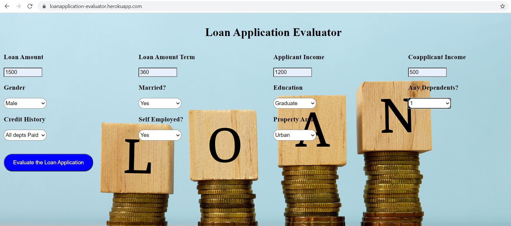

# Loan Application Evaluator, using ML approach, Flask and Heroku.

## Content
A loan application is used by borrowers to apply for a loan. Through the loan application, borrowers reveal key details about their finances to the lender. The loan application is crucial to determining whether the lender will grant the request for funds or credit.

## Problem Statement
Bank identified that going through the loan applications to filter the people who can be granted loans or need to be rejected is a tedious and time-consuming process. If this process can be automated, this will increase bank’s efficiency as well as transparency and a better decision.

## Objective
The idea behind this ML project is to build an ML model and web application that the bank can use to classify if a user can be granted a loan or not.

## Data
[here](https://www.kaggle.com/datasets/altruistdelhite04/loan-prediction-problem-dataset)

## Approach
Following steps are performed:
1. Read the data and perform necessary cleaning and EDA. (Loan_Application.ipynb)
2. Training various models and tune it. (Loan_Application.ipynb)
3. Select best performing model and serialize it using pickle. (Loan_Application.ipynb)
4. Build an webapp using Flask framework. (app.py)
5. Host using Heroku, a Platform as a service.

## Outcome
Based on the data entered on the website and ML Model predicts the whether **Loan Application** is **Approved** or **Rejected**.

## Website

Below is the website hosted in Heroku.

[here](https://loanapplication-evaluator.herokuapp.com/)

  

